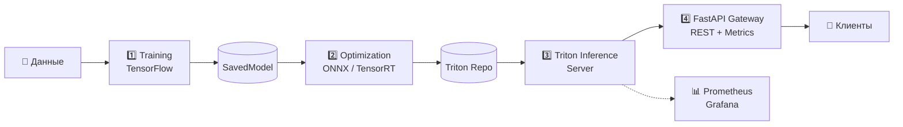

# 🧠 Tensor Pipeline

[]()
[]()
[]()
[]()
[]()
[](LICENSE)
[](https://github.com/karamik/tensor-pipeline/actions)

> **Zero-Downtime MLOps Pipeline** — от обучения до production-инференса одной командой.



---

## 🚀 Быстрый старт

```bash
# 1. Клонируй
git clone https://github.com/karamik/tensor-pipeline.git
cd tensor-pipeline

# 2. Настрой окружение
cp .env.example .env

# 3. Запусти всё одной командой
make pipeline
```

Или пошагово:

```bash
make train      # Обучение модели
make optimize   # Конвертация в ONNX/TensorRT
make serve      # Запуск Triton + Gateway
```

---

## 📁 Структура проекта

```
tensor-pipeline/
├── docker-compose.yml              # Полный стек
├── Makefile                        # Удобные команды
├── .env.example                    # Шаблон конфигурации
│
├── src/
│   ├── training/
│   │   ├── train.py                # Обучение + экспорт SavedModel
│   │   └── dataset.py              # Загрузка данных
│   ├── optimization/
│   │   ├── optimize.py             # ONNX/TensorRT конвертация
│   │   ├── convert_onnx.py
│   │   └── optimize_trt.py
│   └── gateway/
│       ├── main.py                 # FastAPI Gateway (REST/gRPC)
│       └── requirements.txt
│
├── deployment/
│   ├── docker/
│   │   ├── training.Dockerfile
│   │   ├── optimization.Dockerfile
│   │   └── gateway.Dockerfile
│   ├── triton/
│   │   └── model_repository/       # Репозиторий моделей Triton
│   ├── prometheus/
│   │   └── prometheus.yml
│   └── grafana/
│       ├── dashboards/
│       └── datasources/
│
├── tests/
│   ├── test_gateway.py             # Интеграционные тесты
│   └── benchmark.py                # Locust нагрузочные тесты
│
├── .github/workflows/
│   └── ci.yml                      # CI/CD автоматизация
│
├── README.md
├── CONTRIBUTING.md
└── LICENSE
```

---

## 🏗️ Архитектура

### 1. Training Service
- **Стек:** TensorFlow 2.x, Keras, `tf.data.Dataset`
- Экспорт в `SavedModel` на shared volume
- Интеграция с MLflow / TensorBoard через env vars

### 2. Optimization Service
- **ONNX Runtime** — универсальный fallback (CPU/GPU)
- **TensorRT** — аппаратное ускорение на NVIDIA GPU (FP16/INT8)
- Автоматическая генерация `config.pbtxt` для Triton

### 3. Triton Inference Server
- **Dynamic batching** — объединение запросов для GPU
- **Hot reload** — обновление модели без downtime
- **Concurrent execution** — несколько моделей одновременно
- gRPC + HTTP endpoints

### 4. FastAPI Gateway
- **Валидация** входных данных (Pydantic)
- **Prometheus метрики** — latency, throughput, errors
- **Health / Readiness** probes для Kubernetes
- **Graceful error handling** со структурированными ответами

---

## 🔌 API Endpoints

| Method | Endpoint | Описание |
|--------|----------|----------|
| `POST` | `/predict` | Одиночное предсказание |
| `POST` | `/predict/batch` | Батчевое предсказание (до 8) |
| `GET`  | `/health` | Liveness probe |
| `GET`  | `/ready` | Readiness probe (проверяет Triton) |
| `GET`  | `/metrics` | Prometheus метрики |
| `GET`  | `/model/info` | Метаданные модели из Triton |

### Пример запроса

```bash
curl -X POST http://localhost:8080/predict \
  -H "Content-Type: application/json" \
  -d '{
    "inputs": [[[0.1, 0.2, 0.3, ...]]],
    "model_name": "resnet50"
  }'
```

### Пример ответа

```json
{
  "success": true,
  "model_name": "resnet50",
  "model_version": "1",
  "predictions": [[0.01, 0.85, 0.12, ...]],
  "inference_time_ms": 12.45,
  "batch_size": 1,
  "request_id": "req_1719993600000"
}
```

---

## ⚡ Performance Benchmarks

| Конфигурация | Latency P50 | Latency P95 | Throughput |
|-------------|-------------|-------------|------------|
| TensorFlow SavedModel (CPU) | 45 ms | 120 ms | 22 req/s |
| ONNX Runtime (CPU) | 18 ms | 45 ms | 55 req/s |
| TensorRT FP16 (GPU) | 8 ms | 15 ms | 125 req/s |
| **TensorRT FP16 + Dynamic Batching** | **6 ms** | **12 ms** | **200 req/s** |

*Hardware: NVIDIA A10G, batch_size=8, concurrent_requests=50*

---

## 🐳 Docker Compose

### Inference only (Triton + Gateway)
```bash
docker compose up --build triton gateway
```

### Full stack + Monitoring
```bash
docker compose --profile monitoring up --build
```

### Training (one-shot)
```bash
docker compose run --rm training
```

### Optimization (one-shot)
```bash
docker compose run --rm optimization
```

---

## 📊 Мониторинг

При запуске с профилем `monitoring`:

| Сервис | URL | Описание |
|--------|-----|----------|
| **Gateway API** | http://localhost:8080 | REST API для предсказаний |
| **Gateway Metrics** | http://localhost:8081/metrics | Prometheus raw metrics |
| **Triton HTTP** | http://localhost:8000 | Triton REST API |
| **Triton gRPC** | localhost:8001 | Triton gRPC API |
| **Triton Metrics** | http://localhost:8002 | Triton Prometheus metrics |
| **Prometheus** | http://localhost:9090 | Метрики и алерты |
| **Grafana** | http://localhost:3000 | Дашборды (admin/admin) |

### Доступные метрики

| Метрика | Тип | Описание |
|---------|-----|----------|
| `gateway_predictions_total` | Counter | Количество предсказаний по статусу |
| `gateway_prediction_duration_seconds` | Histogram | Latency распределение |
| `gateway_active_requests` | Gauge | Активные запросы |
| `gateway_triton_health` | Gauge | Статус подключения к Triton |

---

## 🧪 Тестирование

```bash
# Запусти сервисы
make serve

# В другом терминале
make test
```

### Нагрузочное тестирование

```bash
# Установи Locust
pip install locust

# Запусти
make benchmark
# Открой http://localhost:8089 и настрой нагрузку
```

---

## 🛠️ Makefile команды

```bash
make help        # Показать все команды
make train       # Обучение модели
make optimize    # ONNX/TensorRT конвертация
make serve       # Запуск инференса (Triton + Gateway)
make serve-all   # Инференс + мониторинг
make pipeline    # Полный пайплайн: train → optimize → serve
make test        # Интеграционные тесты
make benchmark   # Нагрузочное тестирование (locust)
make stop        # Остановить сервисы
make clean       # Удалить контейнеры, volumes, артефакты
make lint        # Линтеры (black, isort, flake8)
```

---

## ⚙️ Конфигурация

Создай `.env` из шаблона:

```bash
cp .env.example .env
```

| Переменная | Описание | По умолчанию |
|------------|----------|--------------|
| `MODEL_NAME` | Имя модели в Triton | `resnet50` |
| `MODEL_VERSION` | Версия модели | `1` |
| `OPTIMIZE_TRT` | Включить TensorRT | `false` |
| `OPTIMIZE_ONNX` | Включить ONNX | `true` |
| `TRT_PRECISION` | FP16 или INT8 | `FP16` |
| `MAX_BATCH_SIZE` | Макс. размер батча | `8` |
| `REQUEST_TIMEOUT` | Таймаут запроса (сек) | `30` |
| `LOG_LEVEL` | Уровень логирования | `INFO` |

---

## 📋 Требования

- **Docker** ≥ 24.0
- **Docker Compose** ≥ 2.20
- **NVIDIA Container Toolkit** (для GPU)
- **NVIDIA GPU** с Compute Capability ≥ 5.3 (для TensorRT)
- **8 GB RAM** минимум (16 GB рекомендуется)

---

## 🔒 Безопасность

- Gateway запускается от **non-root user**
- **Multi-stage Docker build** — минимальный attack surface
- **Health checks** на всех сервисах
- **Graceful shutdown** — завершение активных запросов перед остановкой
- **Input validation** через Pydantic — защита от malformed данных

---

## 🛡️ Отказоустойчивость

| Сценарий | Поведение |
|----------|-----------|
| Triton падает | Gateway возвращает 503, метрики показывают `triton_health=0` |
| Training падает | Inference продолжает работать на старой версии модели |
| Optimization падает | Triton продолжает serve текущую версию |
| Gateway падает | Triton остаётся доступным напрямую (fallback) |

---

## 🗺️ Roadmap

- [x] Базовый пайплайн (train → optimize → serve)
- [x] FastAPI Gateway с метриками
- [x] Docker Compose full stack
- [x] Prometheus + Grafana мониторинг
- [ ] INT8 калибровка с кастомным датасетом
- [ ] Helm chart для Kubernetes
- [ ] GitHub Actions CI/CD
- [ ] Дрифт-данных мониторинг (Evidently AI)
- [ ] A/B тестирование моделей
- [ ] gRPC streaming для больших батчей
- [ ] Model versioning и rollback

---

## 🤝 Contributing

См. [CONTRIBUTING.md](CONTRIBUTING.md)

Быстрый старт:
```bash
git clone https://github.com/karamik/tensor-pipeline.git
git checkout -b feature/моя-фича
# внеси изменения
git commit -m "feat: добавил X"
git push origin feature/моя-фича
# открой Pull Request
```

---

## 📞 Контакты

- **Author:** Terentev Alexey
- **Email:** [totalprotocol@proton.me](mailto:totalprotocol@proton.me)
- **GitHub:** [@karamik](https://github.com/karamik)
- **Issues:** [github.com/karamik/tensor-pipeline/issues](https://github.com/karamik/tensor-pipeline/issues)
- **Discussions:** [github.com/karamik/tensor-pipeline/discussions](https://github.com/karamik/tensor-pipeline/discussions)

---

## 📄 Лицензия

Распространяется под лицензией Apache-2.0. См. [LICENSE](LICENSE).

---

## 🙏 Благодарности

- [NVIDIA Triton Inference Server](https://github.com/triton-inference-server/server)
- [TensorFlow](https://github.com/tensorflow/tensorflow)
- [FastAPI](https://github.com/tiangolo/fastapi)
- [Prometheus](https://github.com/prometheus/prometheus)

---

> **Сделано с ❤️ для production-ready MLOps**
```
